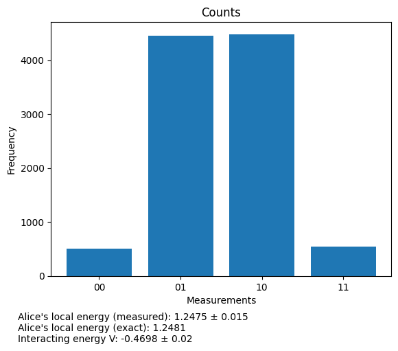
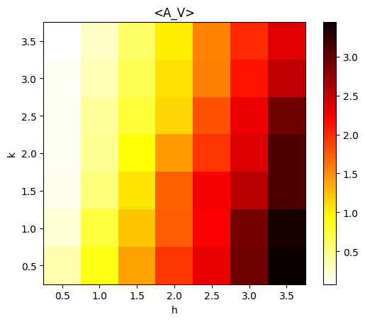
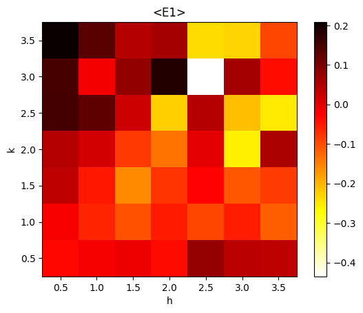
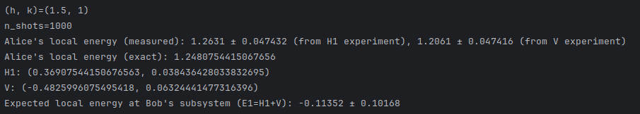

# Quantum Energy Teleportation

## Short Description

A protocol that facilitates the quantum teleportation of energy from one location to another without passing through the space in between.


# Background

In 1993, Charles Bennett and colleagues, proposed a protocol that disassembled a quantum state in one location and reconstructed it elsewhere. They called it quantum teleportation<sup>1</sup>.  The protocol was experimentally demonstrated in 1997 and has since become a standard technique in laboratories all over the world. Today, teleportation is the foundation of a wide range of quantum technologies, including quantum computing, quantum communication, quantum imaging and quantum metrology.  

But other forms of teleportation are also possible. In 2008, Masahiro Hotta at Tohoku University in Japan, showed how to teleport energy using the zero-point energy  field created by natural fluctuation of quantum systems due to the uncertainty principle<sup>2</sup>. These fluctuations can be measured locally but because they are completely random, energy cannot be extracted at this location.

Hotta imagined an experiment in which Alice and Bob share an entangled pair of quantum particles. Alice measures the zero-point energy fluctuation associated with her particle, a process that injects energy into the system. She sends the result of her measurement to Bob who uses it to make a measurement on his particle that maximises its energy, taken from  zero-point energy field. 

In this way, Bob can extract energy from the zero-point field up to the amount that Alice has injected. No energy is gained overall. 

The first demonstrations of energy teleportation have recently been achieved. Nayeli Rodríguez-Briones at the University of California, Berkeley and colleagues, were the first<sup>3</sup> in 2022. The group used a nuclear magnetic resonance experiment with molecules of trans-crotonic acid, to transfer energy from one carbon atom to another, across the same molecule. 

Soon afterwards, Kazuki Ikeda at Stony Brook University in New York, programmed IBM’s cloud-accessible quantum computers to perform the same trick with superconducting qubits<sup>4</sup> over distances roughly the size of a computer chip. 

Longer distances should also be possible and last year, Ikeda showed how the technique might allow energy to be distributed over a future quantum internet<sup>5</sup>.
 
This entry to the 2024 Quantum Internet Application Challenge is a protocol for achieving Ikeda's vision of teleporting energy across the quantum internet. It uses SquidASM to investigate the effect of noise and decoherence on the process to help apply it in the real world.
 

# Applications of Quantum Energy Teleportation 

The ability to teleport energy from one location to another has numerous potential applications. Hotta envisaged it being used in fundamental physics to help study quantum Maxwell's demons, phase transitions at close-to-zero temperatures and the origin of black hole entropy<sup>2</sup>. He also suggested it could power quantum nanodevices, particularly in remote locations where energy is otherwise difficult to source, such as space. 

Energy transfer can also be used for cooling, which introduces the possibility of reducing thermal decoherence during quantum processes for ultra-low temperature experiments and for developing noise-reducing algorithms that maintain coherence during quantum computations. 

Ikeda has also suggested that the tension between supply and demand for teleported energy will lead to a new science of quantum economics that exploits the counter-intuitive strategies, trade offs and capabilities of quantum trading<sup>6</sup>. 

# Comparison with Classical Energy Transport

In classical physics, energy changes form relatively easily – from chemical to electrical to gravitational to kinetic and so on. But to be transported, it always requires a physical medium, be it made of molecules, electrons, photons or similar. This movement is associated with losses that depend on the medium and the distances involved and this ultimately limits how much energy can be moved and by how far. 

Quantum energy teleportation is fundamentally different because the energy, although transported, does not move physically through space. That raises the possibility of transport with unprecedented efficiency and over huge distances.  

In practice, the amount of energy that can be teleported is small. Current experiments work on the Planck scale. However, further work is needed to explore the capabilities and upper limits of this process.


# Description

## Inputs

The inputs into the algorithm are h, k, positive numbers that parameterise the qubit rotation angle. Significantly, they determine how much energy is teleported, so finding their optimal values is an important goal of the simulated runs.

## Algorithm Summary

1. Two qubits are placed into a ground state $\ket{g}$ and shared between Alice and Bob.
2. Alice performs a Hadamard gate operation on her qubit, who adds energy $\braket{A_V}$ to the system.
3. Alice measures her qubit and sends the result to Bob.
4. Bob performs a conditional operation on his qubit, depending on the information from Alice.
5. Since there is no guarantee of energy transfer, when repeated a sufficient number of times the mean value of energy transferred is ultimately positive.

# Experiments and Results

The diagram shows the circuit diagram for quantum energy teleportation (based on Ikeda4). Alice measures the quantum zero-point energy field, which deposits energy $E_0$ into the system. When Bob receives the information about this measurement from Alice, it allows him to measure the zero-point energy field in such a way that the energy fluctuation is more likely to create an energy density lower than the zero-point (denoted $\braket{E_1}$. Because his results in a decrease of energy, he receives that energy through his measuring instrument, on average, $-\braket{E_1}$ (the "transfer energy"). Note that after the two qubits are given to each agent the quantum circuit admits no restriction on their physical separation, hence the "teleportation" of energy must occur.

Various simulated experimental runs were used to determine the conditions for optimal energy teleportation and to study the effect of noise and quantum decoherence on the outcome. 
 
**Figure 1** shows the outcome of 10000 simulated measurements made by Alice and Bob when they perform quantum energy teleportation. $\braket{E_1}$ is not yet shown because its statistical calculation requires data from two different circuits.



**Figure 2** is the result of 1000 simulated parameter sweeps with values of h and k ranging from 0.5 to 3.5. It investigates the energy $\braket{A_0}$ Alice injects into the system when she measures the zero-point energy field at her particle.



**Figure 3** shows the result of a similar 1000 simulated parameter sweeps with values of h and k ranging from 0.5 to 3.5. It shows the mean energy gains for Bob. The squares of interest are those  where $\braket{E1}$ is negative, namely the squares with colours white, yellow or orange. Bob loses energy on average when the squares are black or red.



These results are consistent with the effect measured by Ikeda4 and with his choice to set parameters h, and k to (1, 1.5). This is confirmed in **Figure 4**, which shows the measured energy transfer to Bob along with the error. 

**Figure 4** shows the effect of longitudinal coherence times (T1) and transverse coherence time (T2). As expected, low decoherence times appear to prevent energy teleportation, which occurs only when the coherence of both T1 and T2 is highest. 



## Execution 

Simulation is performed on the NetSquid simulators.

# How to Run

## Requirements

SquidASM and numpy must be installed (tested on an Ubuntu virtual machine)
```
$ pip install numpy
```

## How to run
To run the basic protocol:
```
python -m run_simulation.py
```
To generate the figures:
```
python -m parameter_sweep.py
```
```
python -m noise_sweep.py
```
```
python -m coherence_sweep.py
```
```
python -m outcome_count_histogram.py
```

## About me

I am an A-level student based in London who is currently applying to study mathematics at university next year. I am a Python coder, a quantum technology enthusiast and a keen mathematician. I was runner up in the 2023 Quantum Internet Application Challenge with my entry "Quantum Proprioception".<sup>7</sup>

# References

1.	Bennett, C. H. et al. Teleporting an unknown quantum state via dual classical and Einstein-Podolsky-Rosen channels. Phys. Rev. Lett. 70, 1895–1899 (1993).
2.	Hotta, M. Quantum Energy Teleportation: An Introductory Review. Preprint at https://doi.org/10.48550/arXiv.1101.3954 (2011).
3.	Rodríguez-Briones, N. A., Katiyar, H., Martín-Martínez, E. & Laflamme, R. Experimental Activation of Strong Local Passive States with Quantum Information. Phys. Rev. Lett. 130, 110801 (2023).
4.	Ikeda, K. Demonstration of Quantum Energy Teleportation on Superconducting Quantum Hardware. Phys. Rev. Appl. 20, 024051 (2023).
5.	Ikeda, K. Long-range quantum energy teleportation and distribution on a hyperbolic quantum network. IET Quantum Commun. qtc2.12090 (2024) doi:10.1049/qtc2.12090.
6.	Ikeda, K. & Aoki, S. Theory of Quantum Games and Quantum Economic Behavior. Quantum Inf. Process. 21, 27 (2022).
7. Mullins, Quantum-Proprioception. (2024).

